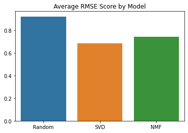

# Fragrance Recommender

## Table of Contents
1. Data Mining
2. Data Wrangling
3. Data Storytelling
4. Inferential Statistics
5. Machine Learning

## Overview
Basenotes.net is an online guide to fragrances with a database of over 20,000 fragrances and over 90,000 user reviews. Building a fragrance recommender system with data from user reviews could help Basenotes.net improve product recommendations and provide additional insight on their customer base and most popular fragrances and brands. The recommender system could also be used for strategic marketing and decisions on affiliate links and advertisements that could increase click rates and provide additional revenue.
